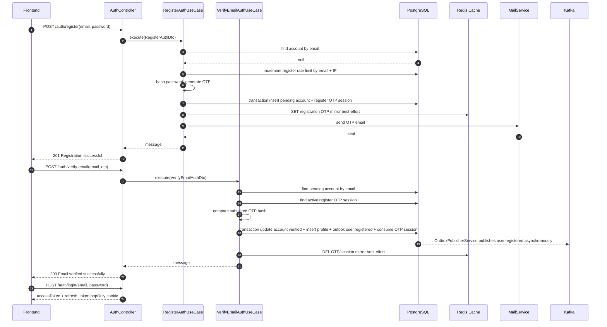
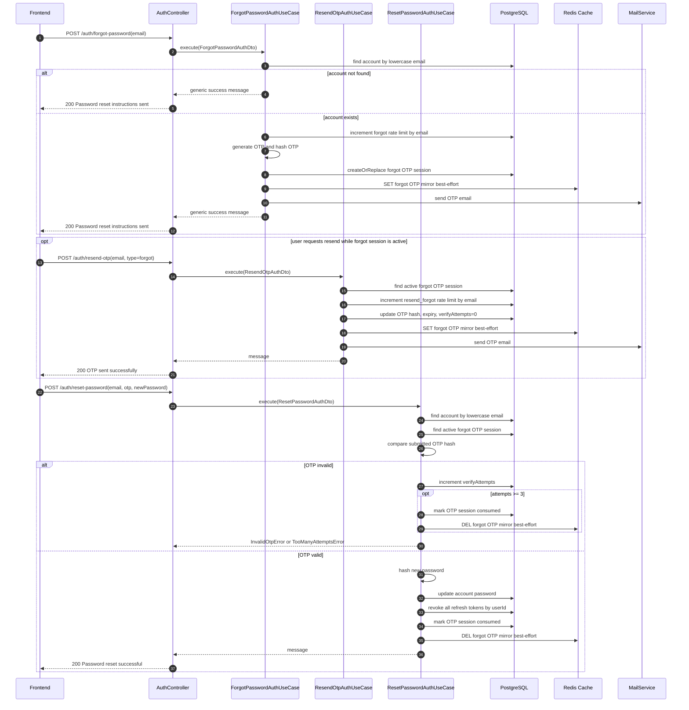

# Identity Service Flows

Last updated: 2026-06-06

Tai lieu nay mo ta flow nghiep vu quan trong cua identity-service. FE nen goi
identity-service qua api_gateway, khong goi truc tiep service noi bo.

Direct service prefix hien tai: `/api/identity`.

Gateway public path hien tai:

- Auth: `/api/auth/*`
- Profile: `/api/user/*`

==================================================

1. # REGISTER ACCOUNT FLOW

# Muc dich

Flow dang ky tai khoan gom 3 buoc:

1. User submit email + password de tao account that o trang thai chua verify
   email va nhan OTP.
2. User submit email + OTP de verify email. Profile va outbox event
   `user.registered` chi duoc tao tai buoc nay.
3. User login de lay accessToken va refresh_token cookie.

Registration flow hien tai KHONG auto-login sau verify email.

# 1.1) API involved

Buoc 1 - Register:

- Method: `POST`
- Gateway path: `/api/auth/register`
- Direct path: `/api/identity/auth/register`
- Auth: public
- Body:

```json
{
  "email": "user@example.com",
  "password": "password123"
}
```

- Validation:
  - `email`: required, valid email.
  - `password`: required, min length 6.

- Success response:

```json
{
  "success": true,
  "code": 201,
  "mess": "Registration successful",
  "data": {
    "message": "OTP sent to your email. Please verify to complete registration."
  }
}
```

Buoc 2 - Verify email:

- Method: `POST`
- Gateway path: `/api/auth/verify-email`
- Direct path: `/api/identity/auth/verify-email`
- Auth: public
- Body:

```json
{
  "email": "user@example.com",
  "otp": "123456"
}
```

- Validation:
  - `email`: required, valid email.
  - `otp`: required, exactly 6 characters.

- Success response:

```json
{
  "success": true,
  "code": 200,
  "mess": "Email verified successfully",
  "data": {
    "message": "Registration successful. Your email has been verified."
  }
}
```

Buoc 3 - Login:

- Method: `POST`
- Gateway path: `/api/auth/login`
- Direct path: `/api/identity/auth/login`
- Auth: public
- Body:

```json
{
  "email": "user@example.com",
  "password": "password123"
}
```

- Success response body co `accessToken`.
- Refresh token duoc set vao httpOnly cookie `refresh_token`.

# 1.2) Backend sequence



# 1.3) Application and infrastructure behavior

RegisterAuthUseCase:

- Lowercase email for DB/session/cache keys.
- Check existing account by email. Existing pending account also blocks register
  and returns `Email already registered`.
- Check and increment registration rate limit in PostgreSQL by email and IP.
- Hash password before storing account data.
- Generate OTP using configured OTP length.
- In one PostgreSQL transaction:
  - Create account with `isEmailVerified = false`, `role = user`,
    `status = active`.
  - Store register OTP session in `auth_otp_sessions`.
- Store OTP as a hash in PostgreSQL, not as raw OTP.
- Best-effort mirror raw OTP to Redis for cache/throttle compatibility:

```text
identity-service:otp:registration:<email>
```

Value:

```json
{
  "code": "123456",
  "attempts": 0
}
```

- Send OTP email.
- Redis failure is logged as warn and does not fail register.
- Register does not create profile and does not write `user.registered`.

VerifyEmailAuthUseCase:

- Lowercase email.
- Find account by email.
- Reject if account does not exist or is already verified.
- Read active register OTP session from PostgreSQL.
- Validate OTP by comparing OTP hash.
- Increment verify attempts in PostgreSQL when OTP is wrong.
- Consume the OTP session after too many invalid attempts.
- In one PostgreSQL transaction via `ProfileProvisionerService`:
  - Set account `isEmailVerified = true`.
  - Create default profile.
  - Store integration event `user.registered` in `outbox_messages`.
  - Mark OTP session consumed.
- Publish pending outbox messages to Kafka asynchronously via
  `OutboxPublisherService`.
- Delete Redis OTP/session mirror best-effort after success.

# 1.4) Data state by step

After successful register:

- Account exists.
- `isEmailVerified = false`
- `role = user`
- `status = active`
- No profile exists yet.
- No `user.registered` outbox event exists yet.
- Finance-service should not create wallet yet.

After successful verify:

Account:

- Table entity: `AccountOrmEntity`
- Email: normalized lowercase email.
- Password: bcrypt hash created during register.
- `isEmailVerified`: `true`
- `role`: `user`
- `status`: `active`

Profile:

- Table entity: `ProfileOrmEntity`
- `userId`: same as account id.
- `email`: account email.
- Default values:
  - `displayName = ""`
  - `avatarUrl = ""`
  - `bio = ""`
  - `phone = 0`
  - `gender = null`
  - `birthday = null`
  - `isCreator = false`

Integration event:

```json
{
  "eventId": "<uuid-v4>",
  "eventType": "user.registered",
  "version": 1,
  "aggregateId": "<userId>",
  "timestamp": "2026-05-29T00:00:00.000Z",
  "traceId": "<trace-id>",
  "sourceService": "identity-service",
  "data": {
    "userId": "<userId>",
    "email": "user@example.com",
    "createdAt": "2026-05-29T00:00:00.000Z"
  }
}
```

# 1.5) Error cases

Register:

- Email already exists, including pending unverified account:
  - HTTP: `409`
  - Message: `Email already registered`
- Too many register attempts by email or IP:
  - HTTP: `429`
  - Message: `Too many attempts. Please try again later.`
- Validation failed:
  - HTTP: `400`
  - Happens when email is invalid, password is missing, or password length < 6.
- Redis unexpected failure:
  - Does not fail the request; service logs warn and continues.

Verify email:

- Account not found or OTP missing/expired:
  - HTTP: `400`
  - Message: `OTP expired or not found`
- Account already verified:
  - HTTP: `400`
  - Message: `Email already verified`
- OTP invalid:
  - HTTP: `400`
  - Message: `Invalid OTP`
- OTP invalid 3 times:
  - OTP session is consumed; user must request/register again depending on
    account/session state.
- Redis cleanup failure:
  - Does not fail the request; service logs warn and continues.

# 1.6) Frontend flow recommendation

1. User enters email and password.
2. FE calls `POST /api/auth/register`.
3. If success, FE navigates to OTP screen and keeps email in page state.
4. User enters OTP.
5. FE calls `POST /api/auth/verify-email` with email and OTP only.
6. If success, FE calls `POST /api/auth/login` with `credentials: "include"`.
7. FE stores `data.accessToken` according to app auth policy.
8. Browser stores `refresh_token` cookie automatically.

FE must not send `password` to `/verify-email` because ValidationPipe uses
`forbidNonWhitelisted`.

FE must not expect token from register or verify-email response.

# 1.7) Current review notes

No blocking issue was found in the core happy path after this refactor:

- Account is created at register as pending unverified.
- Profile is created only after OTP verification succeeds.
- Wallet should be created only after finance-service consumes
  `user.registered`, so wallet creation also happens only after verify.
- Register OTP sending is rate-limited in PostgreSQL by email and IP.
- Redis is a best-effort OTP mirror; PostgreSQL is the source of truth.
- Verify persists account verification, profile, outbox event, and OTP consume
  in one database transaction.
- `user.registered` is persisted to an outbox row so Kafka publish can be
  retried if the broker is temporarily unavailable.
- `user.registered` includes `eventId` and uses
  `sourceService: "identity-service"`.
- Refresh token is not returned by register or verify-email.

==================================================

2. # FORGOT PASSWORD FLOW

# Muc dich

Flow quen mat khau hien tai dung OTP qua email. Backend khong tao reset link
hoac reset token rieng; user dat lai mat khau bang email + OTP + mat khau moi.

Sau khi reset thanh cong, tat ca refresh token cua user bi revoke, nen user phai
login lai tren moi thiet bi bang mat khau moi.

# 2.1) API involved

Buoc 1 - Request forgot password OTP:

- Method: `POST`
- Gateway path: `/api/auth/forgot-password`
- Direct path: `/api/identity/auth/forgot-password`
- Auth: public
- Body:

```json
{
  "email": "user@example.com"
}
```

- Success response:

```json
{
  "success": true,
  "code": 200,
  "mess": "Password reset instructions sent",
  "data": {
    "message": "If the email exists, a reset OTP will be sent"
  }
}
```

Buoc optional - Resend forgot OTP:

- Method: `POST`
- Gateway path: `/api/auth/resend-otp`
- Direct path: `/api/identity/auth/resend-otp`
- Auth: public
- Body:

```json
{
  "email": "user@example.com",
  "type": "forgot"
}
```

- Luu y: API nay chi resend neu forgot OTP session con active trong DB.

Buoc 2 - Reset password:

- Method: `POST`
- Gateway path: `/api/auth/reset-password`
- Direct path: `/api/identity/auth/reset-password`
- Auth: public
- Body:

```json
{
  "email": "user@example.com",
  "otp": "123456",
  "newPassword": "new-password"
}
```

- Validation:
  - `email`: required, valid email.
  - `otp`: required, 6 digits. Backend remove whitespace before validation and
    hash comparison.
  - `newPassword`: required, min length 6.

- Success response:

```json
{
  "success": true,
  "code": 200,
  "mess": "Password reset successful",
  "data": {
    "message": "Password reset successfully. Please login with your new password."
  }
}
```

# 2.2) Backend sequence



# 2.3) Application and infrastructure behavior

ForgotPasswordAuthUseCase:

- Lowercase email for account lookup, OTP session, rate limit key, and cache key.
- Return the same success message when account is missing, to avoid account
  enumeration.
- Rate limit action `forgot` by email: max 3 attempts per 3600 seconds.
- Generate OTP using configured OTP length, default `OTP_LENGTH = 6`.
- Store OTP hash in PostgreSQL table `auth_otp_sessions` with
  `purpose = "forgot"`.
- `createOrReplace` consumes previous unconsumed forgot sessions for the same
  email before creating the new session.
- Mirror raw OTP to Redis best-effort:

```text
forgot:<email>
otp:forgot:<email>
```

- Redis failure is logged as warn and does not fail forgot-password.

ResendOtpAuthUseCase with `type = "forgot"`:

- Require an active forgot OTP session in PostgreSQL. If not found or expired,
  return 400 with `Forgot password session expired. Please request a new OTP.`
- Rate limit action `resend_forgot` by email: max 3 attempts per 3600 seconds.
- Generate a new OTP, update the existing session hash and expiry, and reset
  `verifyAttempts` to 0.
- Send the new OTP email.

ResetPasswordAuthUseCase:

- PostgreSQL is the source of truth for OTP validation. Redis is not required to
  reset the password.
- Find active forgot OTP session from `auth_otp_sessions`.
- Validate OTP by comparing hash of normalized submitted OTP.
- Increment `verifyAttempts` in PostgreSQL when OTP is wrong.
- Consume the OTP session after 3 invalid OTP attempts.
- On valid OTP:
  - Hash new password.
  - Update account password.
  - Revoke all refresh tokens of the account.
  - Mark forgot OTP session consumed.
  - Delete Redis mirror keys best-effort.

# 2.4) Error cases

Forgot password:

- Email does not exist:
  - HTTP: `200`
  - Message remains `If the email exists, a reset OTP will be sent`
  - No email is sent.
- Too many forgot requests:
  - HTTP: `429`
  - Message: `Too many attempts. Please try again later.`
- Redis unexpected failure:
  - Does not fail the request; service logs warn and continues.

Resend forgot OTP:

- Forgot session missing or expired:
  - HTTP: `400`
  - Message: `Forgot password session expired. Please request a new OTP.`
- Too many resend attempts:
  - HTTP: `429`
  - Message: `Too many attempts. Please try again later.`

Reset password:

- Account not found:
  - HTTP: `404`
  - Message: `User not found`
- OTP missing or expired:
  - HTTP: `400`
  - Message: `OTP expired or not found`
- OTP invalid:
  - HTTP: `400`
  - Message: `Invalid OTP`
- OTP invalid 3 times:
  - HTTP: `429`
  - Message: `Too many attempts. Please try again later.`
  - OTP session is consumed; user must request forgot-password again.
- Redis cleanup failure:
  - Does not fail the request; service logs warn and continues.

# 2.5) Frontend flow recommendation

1. User enters email on forgot-password screen.
2. FE calls `POST /api/auth/forgot-password`.
3. Always show a neutral message and move to OTP + new password screen. Do not
   infer whether the email exists from this response.
4. User enters OTP from email and new password.
5. FE calls `POST /api/auth/reset-password` with email, OTP, and newPassword.
6. If success, clear any local auth state and redirect to login.
7. User logs in again with the new password.
8. If user asks for another OTP while session is still active, FE calls
   `POST /api/auth/resend-otp` with `type = "forgot"`.

==================================================

3. # AVATAR UPLOAD FLOW

# Muc dich

Flow cap nhat avatar hien tai upload file qua identity-service, sau do backend
upload len MinIO bang internal client. FE khong upload truc tiep len MinIO nen
khong phu thuoc CORS cua MinIO.

# 3.1) API involved

- Method: `POST`
- Gateway path: `/api/user/users/profile/avatar/upload-url`
- Direct path: `/api/identity/user/users/profile/avatar/upload-url`
- Auth: protected, required `Authorization: Bearer <accessToken>`
- Content-Type: `multipart/form-data`
- Field:
  - `avatar`: file, required.

Supported content types:

- `image/jpeg`
- `image/png`
- `image/webp`

# 3.2) Backend sequence

1. Controller reads multipart field `avatar`.
2. Use case loads current user's profile.
3. Use case validates content type and file size.
4. Use case builds object key:
   `identity-service/avatars/<userId>/<uuid>.<extension>`.
5. Infrastructure uploads object to MinIO.
6. Infrastructure ensures bucket/object is publicly readable.
7. Profile stores new `avatarUrl` and `avatarObjectKey`.
8. After profile save succeeds, backend removes previous avatar object if it
   exists and differs from the new object key.

# 3.3) Frontend flow recommendation

```ts
const formData = new FormData();
formData.append("avatar", file);

await fetch("/api/user/users/profile/avatar/upload-url", {
  method: "POST",
  headers: {
    Authorization: `Bearer ${accessToken}`,
  },
  body: formData,
});
```

FE must not set `Content-Type` manually for this request. Browser must generate
the multipart boundary.

Use `data.avatarUrl` returned from the response, or call
`GET /api/user/users/profile` after upload.
