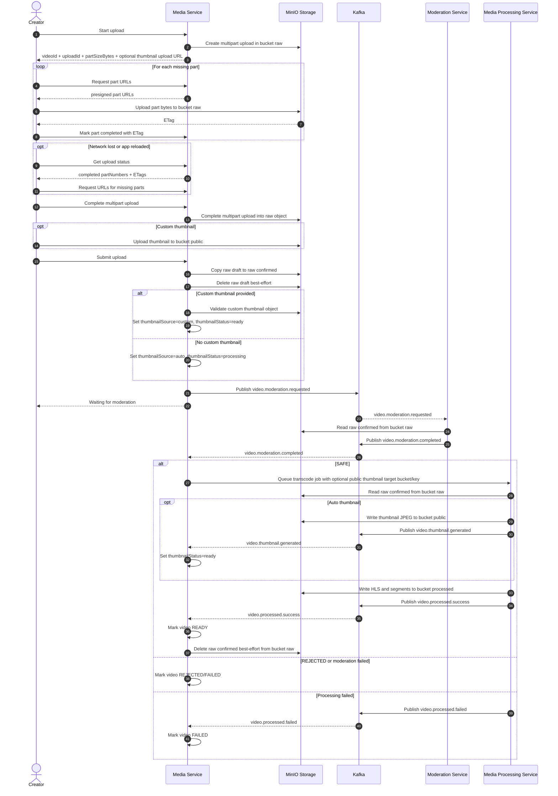

# Bieu do tuan tu

## Quy tac ve bieu do

- Moi actor/service/storage/broker/database chi nen co mot participant duy nhat.
- Phan biet bucket, topic, namespace, status bang message hoac note, khong tao participant moi.
- Ten service, topic/event, endpoint, bucket/object key va thuat ngu chuyen mon giu tieng Anh.

## Tai video len

## Raw file lifecycle

- `uploads/raw/{channelId}/...` is reserved by `POST /api/media/studio/videos/uploads`.
- The client uploads the raw video through MinIO multipart upload parts. Media Service stores `uploadId`, `partSizeBytes`, file metadata and uploaded part ETags in `video_upload_sessions` and `video_upload_parts`.
- `POST /api/media/studio/videos/:videoId/uploads/:uploadId/complete` asks MinIO to assemble the uploaded parts into one raw object at `rawFileKey`.
- `POST /api/media/studio/videos/:videoId/uploads/:uploadId/submit` copies the completed draft object to `uploads/confirmed/{videoId}/{uuid}.mp4`.
- After `video.processed.success`, Media Service deletes the confirmed raw object best-effort.
- If MinIO delete fails, playback still uses bucket `processed`; leftover raw objects can be cleaned manually or by lifecycle cleanup.
- Failed, rejected, cancelled draft, expired draft and hard-deleted videos use their own cleanup flows.

## Resumable upload client rule

- User selects one complete video file.
- Client computes `totalParts = ceil(file.size / partSizeBytes)`.
- For each part, client reads bytes with `file.slice(start, end)`.
- After each successful part PUT, MinIO returns `ETag`; client sends it to `parts/:partNumber/completed`.
- If network is lost, client calls `status`, skips completed `partNumber`s, requests URLs only for missing parts, and continues upload.
- User never manually chooses parts; the part split is only an implementation detail between client, Media Service and MinIO.

## Thumbnail flow

- Custom thumbnail:
  - Client calls `POST /api/media/studio/videos/uploads` with `thumbnailExtension`.
  - Media Service returns `thumbnailObjectKey` and `thumbnailUploadUrl`.
  - Client uploads the image to bucket `public` (`MINIO_PUBLIC_BUCKET`) using the presigned PUT URL.
  - Client sends `thumbnailObjectKey` on `submit`.
  - Media Service validates prefix, extension and size in `MINIO_PUBLIC_BUCKET`, then sets `thumbnailSource = custom`, `thumbnailStatus = ready`, and stores a permanent public `thumbnailUrl`.
  - Late auto thumbnail events never overwrite custom thumbnails.

- Auto thumbnail:
  - If `submit` has no `thumbnailObjectKey`, Media Service sets `thumbnailSource = auto`, `thumbnailStatus = processing`.
  - After moderation `SAFE`, Media Service enqueues the transcode job with target bucket `MINIO_PUBLIC_BUCKET` and key `videos/{videoId}/thumbnails/default.jpg`.
  - Media Processing Service uses FFmpeg to capture a frame, uploads JPEG to bucket `public`, then publishes `video.thumbnail.generated`.
  - Media Service consumes `video.thumbnail.generated` and updates `thumbnailUrl`, `thumbnail_object_key`, and `thumbnailStatus = ready`.
  - Clients render `thumbnailUrl` directly. It is a permanent public MinIO object URL, not a presigned GET URL.
  - If generation fails after retry, Media Processing Service publishes `video.thumbnail.failed`; Media Service sets `thumbnailStatus = failed` and clients should render a placeholder.
